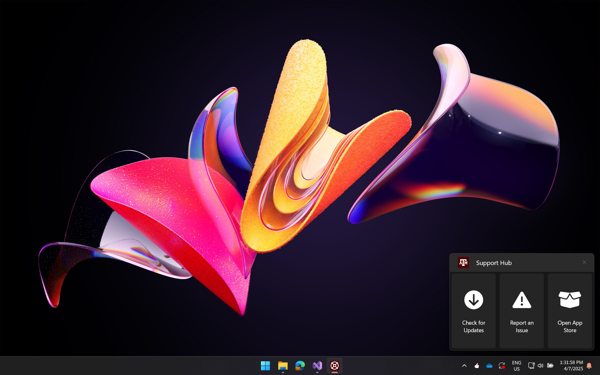
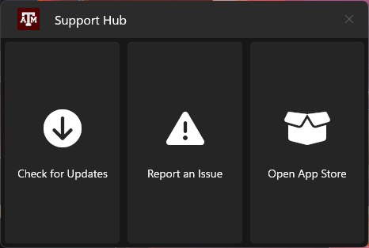
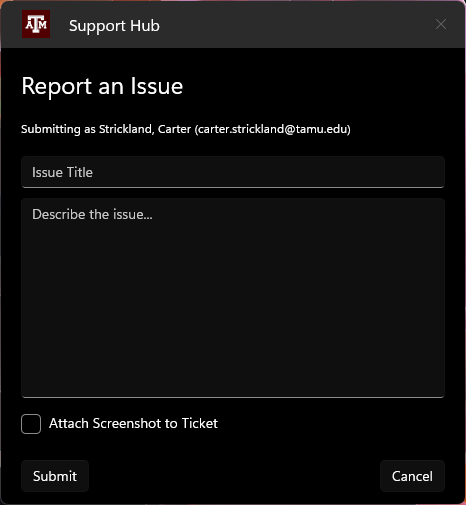
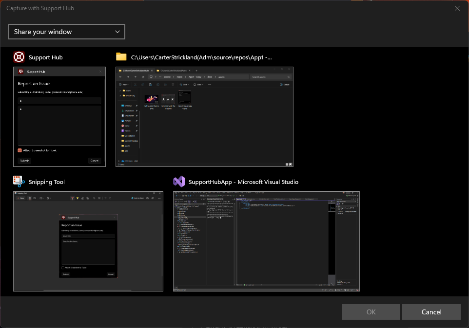

# University Support Hub

The application runs discreetly in the system tray and provides:
* Shortcuts to common IT-related applications (e.g., Intune Company Portal).
* Quick access to Windows Update and Intune Policy Sync.
* An integrated form to report issues directly to the help desk.

## Key Features

* **System Tray Integration:** Resides in the system tray for easy access without cluttering the desktop.
* **Quick Access Shortcuts:** Configurable shortcuts to launch essential applications like the Intune Company Portal and system settings like Windows Update.
* **Built-in Ticket Submission:** A simple form allowing users to provide:
    * Issue Title
    * Detailed Description
    * *Optional* Screenshot (with integrated screen capture tool)
* **System Information:** Automatically collects relevant system information (e.g., OS version, username, machine name) to send along with the ticket, aiding support personnel.
* **Modern Windows UI:** Built using modern Windows UI frameworks for a clean user experience.

## Screenshots

| Description             | Screenshot                                        |
| :---------------------- | :------------------------------------------------ |
| Desktop View            |   |
| Home Screen             |  |
| Report Issue Form       |  |
| Screenshot Selection    |  |

## Technology Stack

* **Language:** C#
* **Framework:** .NET 8
* **UI:** WinUI 3
* **Packaging:** MSIX
* **Icons:** Font Awesome

## Getting Started

### Prerequisites

* Windows 10 (Version 17763) or Windows 11
* .NET 8 SDK
* Visual Studio 2022 (or later) with the following workloads:
    * WinUI application development

### Building from Source

1.  **Clone the repository:**
    ```bash
    git clone <your-repository-url>
    cd <repository-directory>
    ```
2.  **Open the solution:** Double-click `SupportHubApp.sln` to open it in Visual Studio.
3.  **Restore NuGet packages:** Visual Studio should do this automatically, but you can force it by right-clicking the solution in Solution Explorer and selecting "Restore NuGet Packages".
4.  **Build the solution:** Select `Build` > `Build Solution` from the menu (or press `Ctrl+Shift+B`).
5.  **Run the application:**
    * Set `SupportHubApp` as the startup project.
    * Press `F5` to start debugging, or `Ctrl+F5` to run without debugging.

### Installation (if distributing)

1.  Build the project in `Release` mode.
2.  Right-click the `SupportHubApp` project and select `Publish` -> `Create App Packages...`.
3.  Follow the wizard to create an MSIX package.
4.  Distribute the generated `.msix` file and associated certificate (if self-signed) to users. Users will need to trust the certificate before installing.

## Usage

1.  Launch the Support Hub application.
2.  The application icon (a life ring) will appear in the system tray.
3.  **Left-click** the tray icon to open the main application window (showing shortcuts and the report issue button).
4.  **Right-click** the tray icon for quick actions like Exit or Open Window.
5.  Use the buttons in the main window to access Company Portal, Windows Update, or to report a new issue.
6.  When reporting an issue:
    * Fill in the `Title` and `Description`.
    * Optionally, click the "Add Screenshot" button to capture a portion of your screen.
    * Click "Submit" to send the ticket (including system details) to the configured endpoint (Set in `App.config`).

## Running on startup
You can configure machines to run `"shell:appsFolder\UniversitySupportHub_ptw92rvs1bhse!App" /background` on startup to launch the app in background mode (adds icon to system tray without activating the window).

## Single Instance Only
The app cannot have multiple instances running at the same time. If the user tries to launch the app from the start menu despite it already running, it will activate the window of the existing instance.
If a second instance of the app is started with the `/background` flag, it will have no effect.

## Contributing

Contributions are welcome! If you find a bug or have a feature request, please open an issue on the project's issue tracker. If you'd like to contribute code, please fork the repository and submit a pull request.

## Acknowledgements

* Inspired by the [macOS Support App](https://github.com/root3nl/SupportApp) developed by Root3.
* Uses Font Awesome for iconography.
